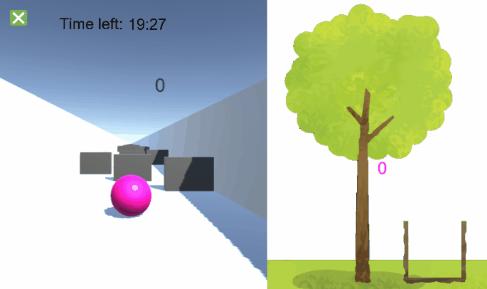
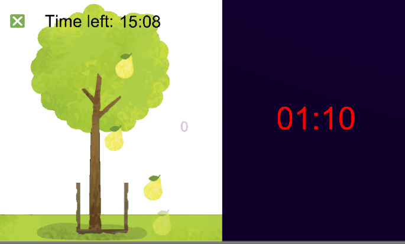

## MultiPlay - Multitasking game for dementia patients

### Introduction
Our game application focuses on multitasking as this helps to helps to prevent dementia as shown by a study by the US National Institute of Medicines. It shows the role of cognitive and physical activities in the aid of preventing dementia.

Our aim is to create a mobile application which aims to train the ability of multitasking of the individual user. The game is designed to help users coordinate their actions better and increase brain engagement while working on different tasks simultaneously.

### How does the game look like?
The main focus of the system lies in three mini-games that are designed solely to train user’s concentration. The three games include:
- **MazeExplore**: Direct a runner to the end point of a maze
- **FruitDrop**: Collect all fruits falling from the tree into a basket
- **TimeBomb**: Tap on the time bomb within a set time frame to stop it from exploding

At any one time, two of the games above will be loaded together in one screen and the games will be played concurrently. Depending on the difficulty of the game, the games will be paired differently. 

